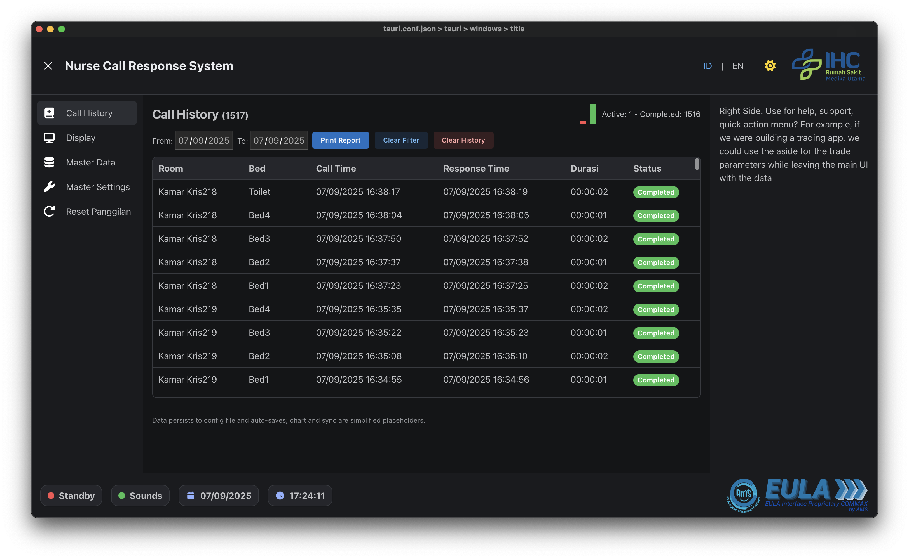
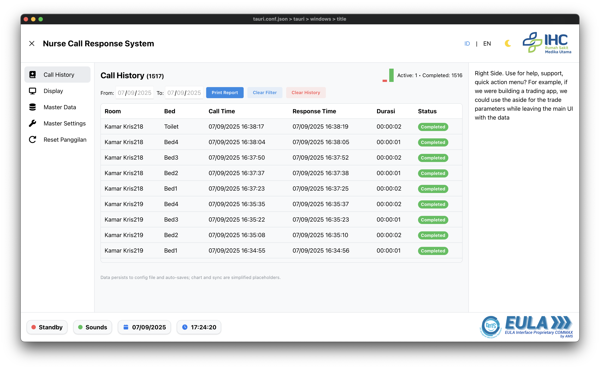
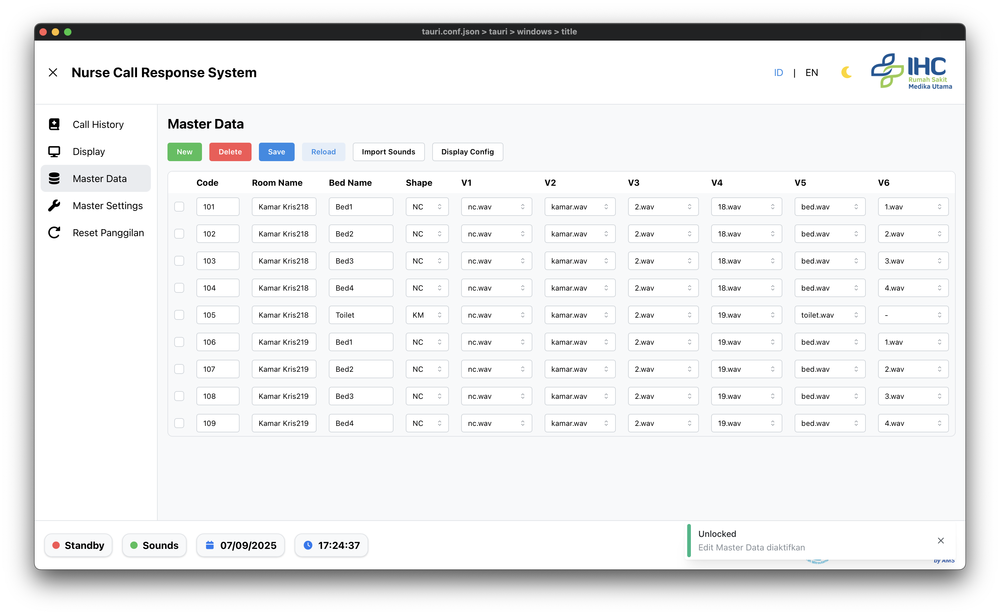
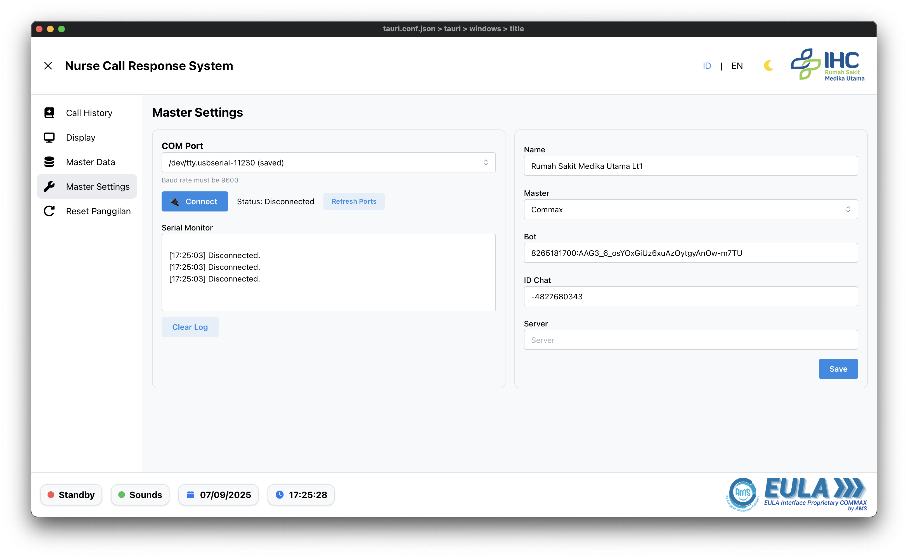

# Nurse Call Response System (NCRS)

Terakhir diperbarui: 2025-09-07

Aplikasi desktop untuk menerima, mengantri, dan mengakui panggilan perawat (nurse-call) dari perangkat serial, menampilkan UI real‑time, serta memutar audio notifikasi secara berurutan. Dibangun dengan Tauri v2 (Rust) dan React 19 + TypeScript, ringan dan dioptimalkan untuk perangkat Windows berlayar 1366×768.

## Pratinjau









## Fitur Utama

- Input serial: deteksi koneksi, auto-reconnect, dan event real‑time.
- Antrian panggilan: penanganan burst dengan backpressure, tanpa freeze UI.
- Audio terurut: putar file suara `.wav` sesuai master data (V1–V6) tanpa overlap.
- Riwayat panggilan: daftar aktif/selesai, filter tanggal, ekspor/print laporan PDF.
- Master Data: pemetaan kode perangkat ke ruangan/bed dan daftar suara.
- Master Settings: pilih COM port, tipe master (Commax/AIPHONE), bot/ID chat/server.
- i18n: EN/ID/FR dan dukungan tema gelap/terang (Mantine v8).

## Persyaratan Sistem

- OS: Windows 10 64‑bit.
- Target perangkat: Pipo X9S (Intel Celeron N4020, RAM 3–4 GB, eMMC 64 GB).
- Tampilan: 1366×768 (UI responsif, tanpa scroll trap; target klik ≥ 40 px).

## Teknologi

- Desktop: Tauri v2 (Rust) + plugin: autostart, logging, updater, process, fs, shell, dialog, os, notification, deep‑link, window‑state, single‑instance, store, serial‑port.
- Frontend: React 19, TypeScript, Mantine v8, React Router v7, i18next.
- Build/Test: Vite v6, Mocha/Chai, Selenium WebDriver.
- Storage: localforage, Tauri store, js-cookie.

## Instalasi & Menjalankan

1) Siapkan prasyarat Tauri dan Rust (lihat dokumentasi Tauri v2).
2) Instal Node.js LTS dan pnpm.
3) Pasang dependensi:

```
pnpm install
```

4) Jalankan mode pengembangan (window debug Tauri + Vite dev server):

```
pnpm dev
```

5) Build frontend produksi:

```
pnpm build
```

6) Build rilis aplikasi desktop (bundling Tauri):

```
pnpm rls
```

Skrip lain yang tersedia: `pnpm test` (Mocha), `pnpm preview`/`pnpm serve` (pratinjau Vite).

## Konfigurasi Data & Audio

- File konfigurasi dapat dibaca dari `public/config.json` saat pengembangan. Berisi `masterSettings`, `masterData`, dan penyimpanan riwayat.
- Letakkan file audio `.wav` di `public/sounds/`. Pada Master Data, kolom V1–V6 menunjuk ke nama berkas (mis. `nc.wav`, `kamar.wav`, `1.wav`).
- COM port default menggunakan baud rate `9600`.

Struktur kunci umum `config.json` (contoh singkat):

```
{
  "masterSettings": { "com": "COM3", "masterType": "Commax" },
  "masterData": [
    { "charCode": "101", "roomName": "Bougenville", "bedName": "01", "shape": "NC", "v1": "nc.wav" }
  ],
  "callHistoryStorage": []
}
```

## Alur Pakai Cepat

- Buka menu Master Settings, pilih `COM` port yang sesuai, lalu `Connect` (baud 9600). Status koneksi akan tampil real‑time.
- Isi Master Data: map `charCode` perangkat ke `roomName/bedName` dan pilih suara V1–V6 sesuai kebutuhan.
- Saat perangkat mengirim kode panggilan valid, aplikasi akan:
  - Menambah entri aktif pada Riwayat.
  - Memutar audio sesuai urutan (V1→V6) tanpa tumpang tindih.
  - Mengirim event UI dan notifikasi.
- Sinyal “enclose/response” dari perangkat akan menandai panggilan sebagai selesai.

## Catatan Kinerja

- Target p95 end‑to‑end (serial→UI→audio) ≤ 100 ms pada perangkat target.
- Idle CPU ≤ 3%, aktif ≤ 25% selama burst 10 menit; heap stabil.
- UI dioptimalkan untuk 1366×768 dan keyboard‑first.

## Pengembangan & Pengujian

- Unit/Integrasi: Mocha/Chai untuk logika TS; pengujian parser/queue dan kontrak perintah Tauri.
- E2E: Selenium (viewport 1366×768) untuk alur utama, aksesibilitas dasar, dan smoke test.
- Skrip:
  - `pnpm test` menjalankan Mocha.
  - `pnpm dev` untuk pengembangan cepat; `pnpm rls` untuk bundel rilis.

## Lisensi

Lihat `LICENSE.md` pada repositori ini.
